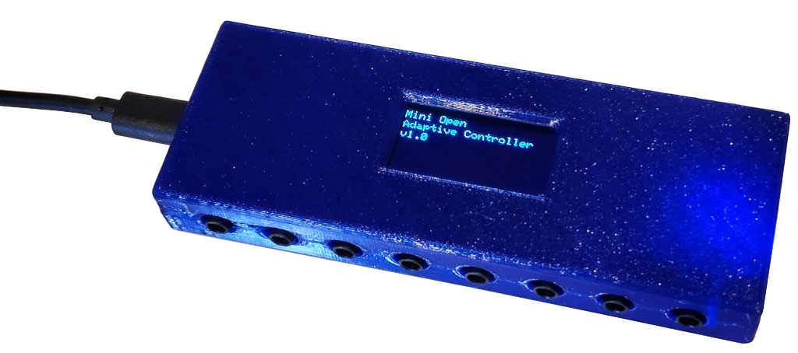

Mini Open Adaptive Controller
==============================

Universal input device that allows external switches, buttons, etc
to be connected using 3.5mm mono plugs, and then emulate a USB
keyboard, mouse, joystick, or game controller to send HID events
to a computer or game console.

This allows custom-made assistive-technology input devices to be
connected to a computer or game console. Functionally this is very
similar to the Microsoft Xbox Adaptive Controller, but with fewer
inputs, a fully open-source design, a display, and more device emulation
options.

Based on the ATmega32u4 microcontroller, compatible with the Arduino
Leonardo.

Features:

 * 8 switch inputs with 3.5mm mono sockets
 * USB-C socket for connection to computer, game controller, etc
 * Customise the software to suit your needs
 * 128x64 OLED module (SH1106)
 * ATmega 32u4 MCU (Arduino compatible)
 * Piezo beeper
 * Beep on/off switch
 * HWB (hardware boot) button and solder jumper to allow disabling bootloader

You can view more details at:

  http://www.superhouse.tv/moac

Hardware
--------
The "Hardware" directory contains the PCB design as an EAGLE project.
EAGLE PCB design software is available from Autodesk free for
non-commercial use.

Firmware
--------
The "Firmware" directory contains multiple versios. We have experimented
with different OLEDs and libraries during development, so this is a
collection of the different firmware versions.

The most recent hardware uses a 128x64 OLED with the SH1106 driver.

Unfortunately the various SH1106 drivers are a bit strange, and the best
I've found is the version of Adafruit's SSD1306 library that was forked
by wonho-maker and modified to add SSD1306 support. That version is not
available through the Arduino library manager, so it's been embedded
directly within the project.

Enclosure
---------
The "Enclosure" directory contains STLs for a case that can be
3D-printed.

The two halves of the case should be printed with the flat face down to
the printer bed.

The case can be held shut by countersunk self-tapping screws.

Credits
-------
 * Jonathan Oxer <jon@oxer.com.au>
 * Chris Fryer <chris.fryer78@gmail.com>

License
-------
Copyright 2018-2020 SuperHouse Automation Pty Ltd  www.superhouse.tv  

The hardware portion of this project is licensed under the TAPR Open
Hardware License (www.tapr.org/OHL). The "license" folder within this
repository contains a copy of this license in plain text format.

The software portion of this project is licensed under the Simplified
BSD License. The "licence" folder within this project contains a
copy of this license in plain text format.
